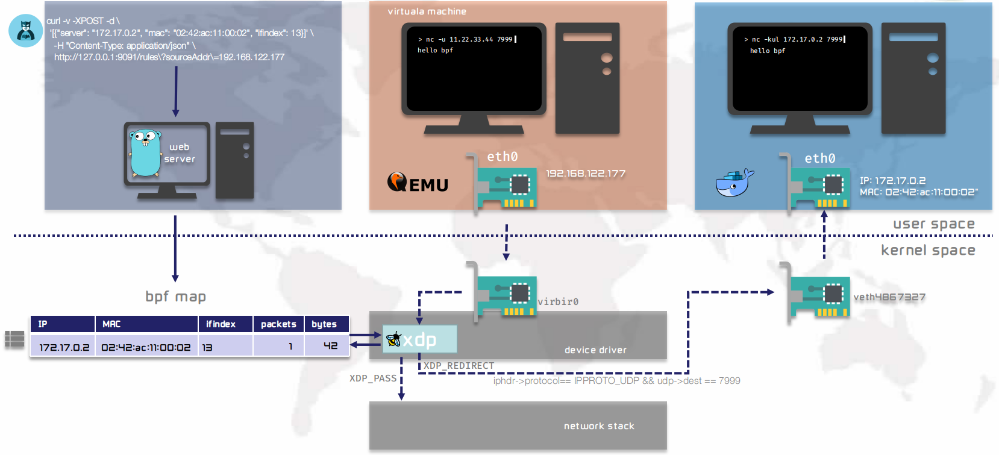

## xdp-redirect demo

An epbf program to demonstrate how the XDP redirect packets

## Prerequisites

### Prepare development environment

Need to prepare the eBPF development environment, you can refer the Cilium document of [BPF and XDP Reference Guide](https://docs.cilium.io/en/stable/bpf/#development-environment)

### Background

The program demonstrates the XDP redirects UDP packages to another network interface. The following diagram illustrates the background in which the demo was run.

There are five components which are responsible for different roles in our scenarios:

- **Web server**: A web server implemented in Golang, which is dedicated to provide API for users maintain redirecting rules for the XDP program.
- **A virtual machine**: A KVM hypervisor based virtual machine, the guest os is linux, which run a netcat program, sending UDP requests from the virtual machine.
- **XDP**: an eBPF program, which attach to the virtual machine's bridge interface (virbr0), triggered by incoming packets. When arrived packets is the UDP protocol and destination port is `7999` , the XDP program will redirects packets to a specific interface according to redirecting rules in the eBPF map.
- **Docker container**: a container is dedicated to receiving packets redirected by the XDP program. the redirected packets are sended to UDP server in container via the container's veth pair interface.
- **Redirecting rules**: Redirecting rules is a array which contain Mac, IP address and interface index. When The XDP program is triggered, it deicides to chose an information of the rule to redirect packet.

## Get Started

### How to build program

After cloning this repository, you need to build the web server programming and eBPF program. 

- **Build web server**: In the root directory of the repository, run make in the shell environment. The target binary `xdplbmgmt` will be built in the `bin/` directory.

> The web server is implemented in Golang, you need to prepare the golang development environment in advance.

- **Build eBPF program**: In the root directory of the repository, run `git submodule update --init` command to update `libbpf` sub module. After the `libbpf` module is downloaded, enter the `ebpf` directory, run `make` to build the ebpf target. the ebpf target `xdp_redirect.o` is generated in the current directory (`ebpf/`)

### How to run demo program

